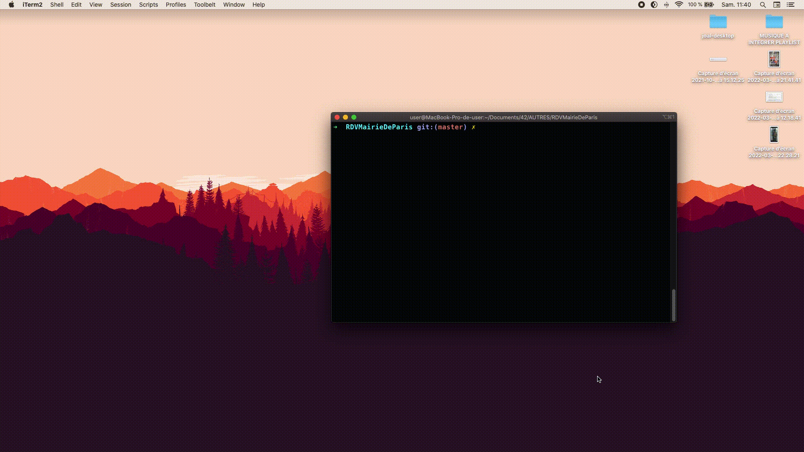

# MAJ - IMPORTANT ⚠️ 
Suite à d'importantes modifications sur le site teleservices.paris.fr, ce script ne fonctionne plus pour deux raisons : 
1) les requêtes HTTP provenant d'une même IP sont bloquées au bout d'un certain nombre de requêtes. Une **rotation d'I.P** est à mettre en place
2) l'utilisation d'un compte + captcha contraignent la connexion au site. 
Je manque de temps pour mettre en place ces solutions. N'hésitez pas !

  
# RDVMairieDeParis

## ante-scriptum 🇬🇧 -> 🇫🇷
This script was made to facilitate slot reservation on https://teleservices.paris.fr/. This is a french website used by french users. Therefore, this README will be in french

## Description

Refaire ses **papiers d'identité** est devenu une tannée. Les créneaux sont rares et s'envolent vite. 
Reprenez le contrôle et devenez la meilleure version de vous-même grâce à cet outil.

Ce script permet de prendre rendez-vous en mairie **parisienne**, quasi-automatiquement, pour renouveller ou créer une carte d'identité ou un passeport, pendant que vous faites autre chose.

Rentrez les données demandées au lancement du script. Laissez la page qui s'ouvre tourner en tâche de fond. Vous recevez une notification sur votre ordinateur lorsque le créneau est trouvé. Rentrez le captcha. 
Vous avez un rendez-vous 🤝

Fonctionne sur **Linux** 🐧 & **MacOS** 🍏 & **Windows** 🪟

## Installation

#### 🚀 Installation Automatique
Lancez le script `./install_script.sh`

#### 💪 ...ou Installation Manuelle
 * installez **google Chrome** si celui-ci n'est pas installé.
 * installez **Python3** et le gestionnaire de paquet **pip** ou **pip3**.
 * installez les **bibliothèques** nécessaires au script : `pip3 install notify-py selenium`
* utilisez votre gestionnaire de paquets (`brew` sur MacOS, `apt`, `pkg`, `pacman`, etc..) pour installer **chomedriver** : `sudo apt install chromium-chromedriver` ou `brew install chromedriver`
* Let's Go !

#### :hatched_chick: Compatibilité avec environnement Windows
Le fonctionnement de `selenium` sur Windows nécessite de télécharger **chromedriver** sous forme d'exécutable (voir : https://chromedriver.chromium.org/downloads).
L'exécutable est placé dans le même répertoire que le script `./RDVMairiedeParis.py`, ou est déclaré dans le PATH (voir : https://docs.microsoft.com/fr-fr/windows/deployment/usmt/usmt-recognized-environment-variables).

## Usage

`python3 ./RDVMairiedeParis.py <arrondissement> <jour> <heure>`

exemple : 
`python3 ./RDVMairiedeParis.py 75017 28/03/2022 18:15`

⚠️  Plus vous rajoutez d'**arguments**, moins vous aurez de chance de trouver un créneau. Restez flexibles.

##### I. pas d'arguments

`python3 ./RDVMairiedeParis.py`

Le script cherche dans toutes les mairies de Paris et réserve le premier créneau disponible.

##### II. Mairie

`python3 ./RDVMairiedeParis.py <arrondissement>`

Le script cherche dans la mairie demandée jusqu'à ce qu'un créneau se libère.

##### III. Mairie + Jour

`python3 ./RDVMairiedeParis.py <arrondissement> <jour>`

Le script cherche dans la mairie demandée, au jour demandé jusqu'à ce qu'un créneau se libère.

##### IV. Mairie + Jour

`python3 ./RDVMairiedeParis.py <arrondissement> <jour> <heure>`

Le script cherche dans la mairie demandée, au jour demandé, dans l'heure spécifiée jusqu'à ce qu'un créneau se libère.

